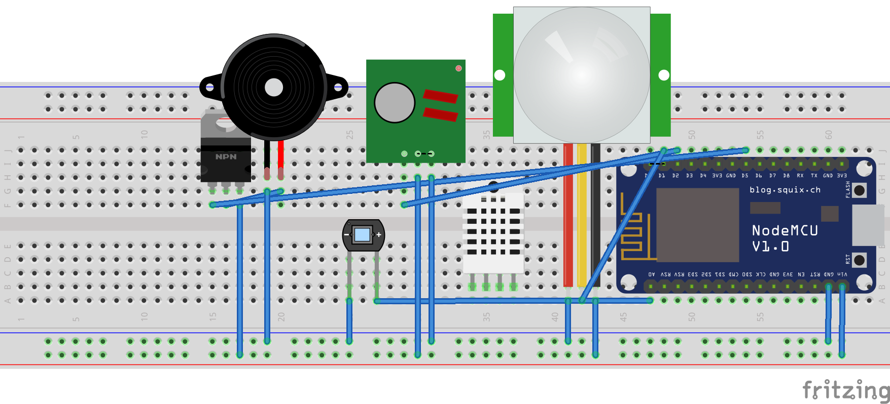

# ESPlights

This is a home automation controller and sensor that I wrote for my house.

It's mostly ad-hoc, but hopefully you'll find something here that will help you.

## Components

To make everything work, you need:

* A NodeMCU (that's what I used) or another compatible ESP8266 thing. An Arduino
  would probably also work.
* An infrared LED.
* A 433 MHz RF transmitter.
* An alarm (I used one of those magnetic window alarm thingies).
* An analog light sensor.
* A DHT11 temperature/humidity sensor.
* A pyroelectric IR motion sensor.

There are multiple components to this project, which will be explained below.

### A wifi-enabled MQTT client

I use the ESP8266 to connect to the home wifi network and from that to my MQTT
server, which allows all the below functionality to work. All the sensors and
transmitters report to and receive commands from MQTT topics.

### An RF transmitter

I bought some [RF-controlled
sockets](http://www.alibaba.com/product-detail/remote-control-socket-wireless-socket-rf_60038866245/showimage.html)
and decided to automate some lights in my house, so
I [reverse-engineered](http://www.stavros.io/posts/how-remote-control-rf-devices-raspberry-pi/)
the protocol and wrote some code to [control the lights
remotely](http://www.stavros.io/posts/control-rf-devices-with-arduino/). This is
why you need the RF transmitter. If you don't have those sockets, you can just
ignore that part of the code.

### A motion sensor

The motion sensor is used for the lights above, it turns them off if there's no
motion in X minutes and turns them back on if motion is detected.

### Light, temperature and humidity sensors

The light sensor is used for the lights too. If there's no light and there has
been motion lately, the lamp turns on, and it turns off if there's a lot of
light detected suddenly (it means that I turned some other light on).

The temperature and humidity sensors are just for fun.

### An alarm

The alarm is triggered if I have indicated that I'm not at home and motion is
detected. I also get a message on my phone, but all this is done with an
external script that is not included here.

### A universal IR remote control

Since I had this, I figured I'd write some code to control my TV and AC unit.
There's a helper script, `misc/esplights.py` that will:

* Transform timings, options, parameters, etc passed on the command line into a
  suitable format for the ESPlights controller to read.
* Enable and disable automation (whether lights are turned on or off
  automatically). This only lasts for a few hours before it times out.
* Activate and deactivate the alarm.
* Help you analyze timings. Pass it a CSV from a Saleae Logic export and it will
  print timings compatible with itself (for analyzing IR and RF signals).

The remote control protocol allows you to send any RF or IR signal (the pin is
selectable), and optionally add a carrier wave. The `duty_high` and `duty_low`
parameters define the duty cycle (in μs), and a low duty cycle of 0 means no
carrier (the timings will sent on a fully-high) signal. This allows you to
modulate everything from RF to AC to TV (all of which use different or no
carriers) through one protocol.

### A sensor aggregator

ESPlights will send its sensor readings to an MQTT topic once a second. I just
plot them somewhere so I know what's going on, but you can do whatever. I also
have an XMPP bot that I can talk to and get a reading of the sensors if I'm on
my mobile. Go nuts.

## Cetera

That's about it for this repo. It also supports OTA updates, which are very
useful if you don't want to be connecting the sensor to your computer to update
it. Just set the key in the definitions at the top of the source file and you're
good to flash using espota.

If you have any feedback or whatever, open an issue or (even better) issue a
pull request. I can't guarantee that I'll merge it, and I'm a bit of a dick, so
bear with me.

There's also a Fritzing file of roughly how the connections go, but it's not
complete because my components had the wrong pinouts and I couldn't find some of
the components I'm actually using. Feel free to update it and issue a PR.

Here's what it looks like:

## License

This repository is released under the GPL v3.
